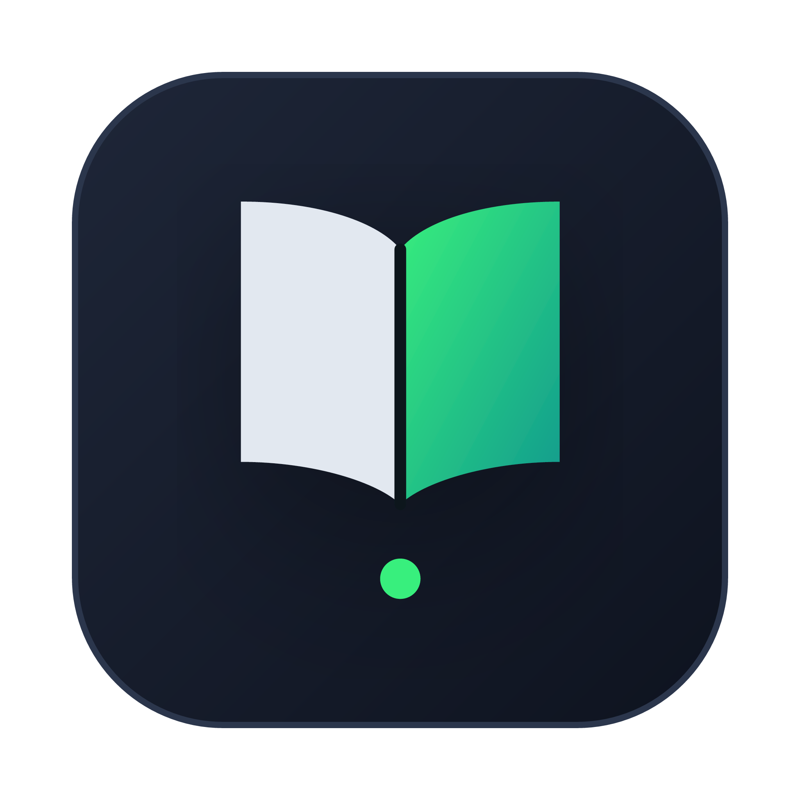

# NanoPDF
### Lightweight Apple Silicon native PDF reader

  

This reader uses MuPDF as its engine, so it only loads the PDF's page that appears on screen, and it doesn't load the whole document in memory, saving up on a lot of RAM and, if used correctly, also on CPU.

**What do I mean used correctly?** I mean, since it's loading one page a time, if you scroll down one page, it will forget the previous page since it's not in memory, so if you scroll up again you'll use your CPU again to load it. Of course it won't use that much CPU for single pages, but if you scroll up and down endlessly you might stress out your computer a little bit. So using it correctly just means I presupposed it's going to be used to read PDFs slowly page by page, or, if necessary, use the Jump to Page button to find a specific page.

**Why did I make this?** This app is inspired by SumatraPDF, but made for MacOS since Sumatra is for Windows only, and I made it because I needed it myself, since I have a MacBook with only 8GB of unified memory, which cannot be expanded. We have a RAM crisis nowadays, but software gets more and more bloated, so I think everyone should have their users' hardware needs in mind.
