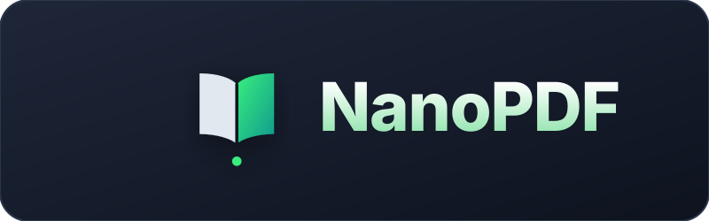

# NanoPDF
### Lightweight Apple Silicon native PDF reader

  

This reader uses MuPDF as its engine, so it's highly optimized to save up on a lot of RAM.

**Why did I make this?** This app is inspired by SumatraPDF, but made for MacOS since Sumatra is for Windows only, and I made it because I needed it myself, since I have a MacBook with only 8GB of unified memory, which cannot be expanded. We have a RAM crisis nowadays, but software gets more and more bloated, so I think everyone should have people's hardware needs in mind.
